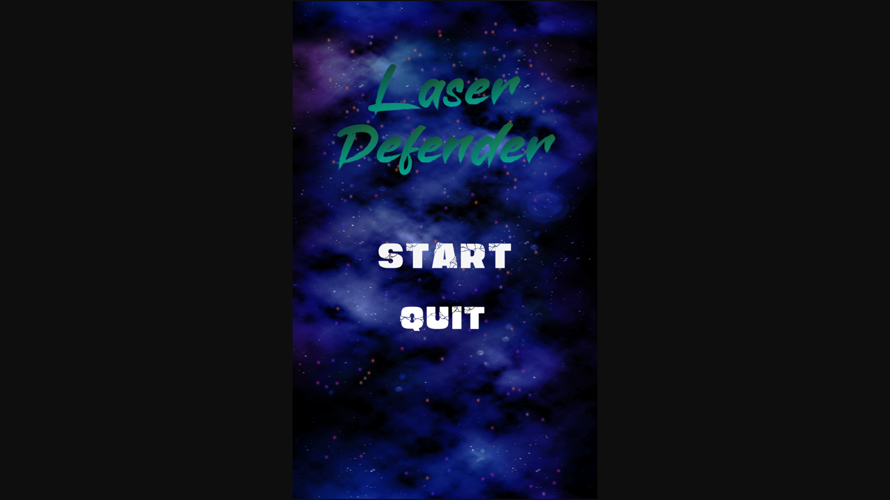
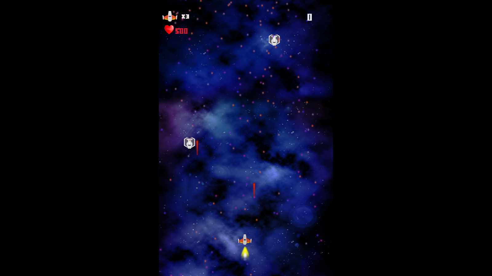

# Laser Defender
Top-Down Space Shooter Game (Old Style Shoot 'em up game)

## Side Note
The sprites used in the game are made by Kenney or www.kenney.nl under common creative license

## Laser Defender Objectives:
 1. Recreating game's logic using coroutines
 2. Using Scriptable Objects for enemy wave creation.
 3. Creating a simple waypoint system for better looking AI
 4. Recreating particle systems used in Laser Defender V1

